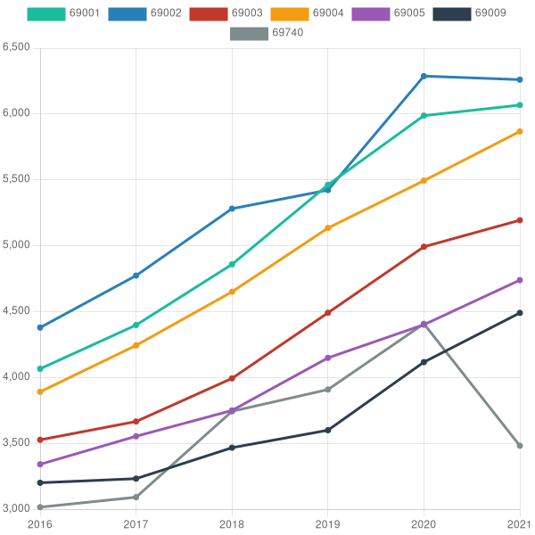

# Immo trends

Analyse les données libre des [demandes de valeurs foncières](https://www.data.gouv.fr/fr/datasets/demandes-de-valeurs-foncieres/) pour produire un graphique de l'évolution des prix par code postal



## Utilisation

Installez les dépendances

```sh
npm install
```

Initialiser les données et la base SQLite :

```sh
./init.sh
```

Cela télécharge automatiquement les fichiers CSV, les décompresse dans le dossier `data` et importe les données dans `dvf.sqlite3`.

Ensuite générez le graphique en spécifiant les codes postaux (le schéma de la base est défini dans `init.sql`) :

```sh
npm run draw -- 69001 69002 69003 69004 69005 69006 69007 69008 69009 69740
```

Les statistiques (médiane, moyenne, min, max) sont calculées à la volée par SQLite.

## Interface web (Nuxt)

Ce dépôt inclut une application [Nuxt 4](https://nuxt.com/docs/4.x/getting-started/installation) dans le dossier `app/`.

Lancer le serveur de développement :

```sh
npm run dev
```

Ouvrir [http://localhost:3000](http://localhost:3000) dans le navigateur.

La carte charge les transactions DVF visibles dans la fenêtre courante via l'API `GET /api/dvf`. Un panneau statistiques en bas de la carte affiche le min/médiane/max au m² et l'évolution annuelle via `GET /api/dvf-trends`. Zoomez au niveau 10 ou plus pour afficher les points. Voir la [documentation de l'API](docs/api.md).

La barre de navigation propose un lien vers la page [`/about`](http://localhost:3000/about) qui décrit la source des données (DVF, data.gouv.fr) et la licence. Voir [docs/pages.md](docs/pages.md) pour le détail des pages.

> **macOS** : Nuxt 4.4.7 place le socket vite-node dans un chemin temporaire qui peut dépasser la limite de 104 caractères du système. Le script `dev` utilise `TMPDIR=/tmp` pour contourner ce problème ([nuxt/nuxt#35264](https://github.com/nuxt/nuxt/issues/35264)).

Autres commandes utiles :

```sh
npm run build     # build de production
npm run preview   # prévisualiser le build
npm run generate  # génération statique
```

## Base de données

Le schéma de la base de données SQLite (`dvf.sqlite3`) est défini dans le fichier `init.sql`. Les index de la carte sont créés automatiquement à l'import (`indexes.sql`). Pour une base existante :

```sh
sqlite3 dvf.sqlite3 < indexes.sql
```

## Déploiement

Un `Dockerfile` et un `docker-compose.yml` sont fournis pour déployer l'application (typiquement sur un VPS avec Docker Swarm) :

```sh
export IMAGE=ghcr.io/madeindjs/immo-trends:latest
docker stack deploy -c docker-compose.yml immo-trends
```

La base SQLite est stockée dans un volume Docker nommé (`dvf-data`) afin d'éviter de retélécharger et réimporter le jeu de données (~6 Go) à chaque mise à jour de l'image. Voir [docs/deploy.md](docs/deploy.md) pour le détail.

## Nettoyage

Pour supprimer les données calculées et la base de données :

```sh
npm run clean
```

## TODO

- [x] automatiser le téléchargement des données
- [x] utiliser SQLite pour le stockage et les calculs
- [x] ajouter une interface web Nuxt
- [ ] réaliser des statistiques plus profondes
