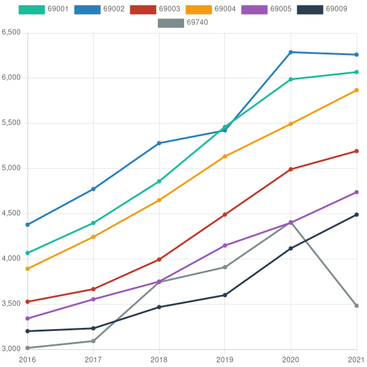

# Immo trends

Analyse les données libre des [demandes de valeurs foncières](https://www.data.gouv.fr/fr/datasets/demandes-de-valeurs-foncieres/) pour produire un graphique de l'évolution des prix par code postal



## Utilisation

Installez les dépendances

```sh
npm install
```

Télécharger les jeux de données et placez les dans le dossier `data`

puis lancez

```sh
node compute.js
```

Ensuite générez le graphique en spécifiant les code postaux

```sh
node draw.js 69001 69002 69003 69004 69005 69006 69007 69008 69009 69740
```

## TODO

- [ ] réaliser des statistiques plus profondes
- [ ] automatiser le téléchargement des données
